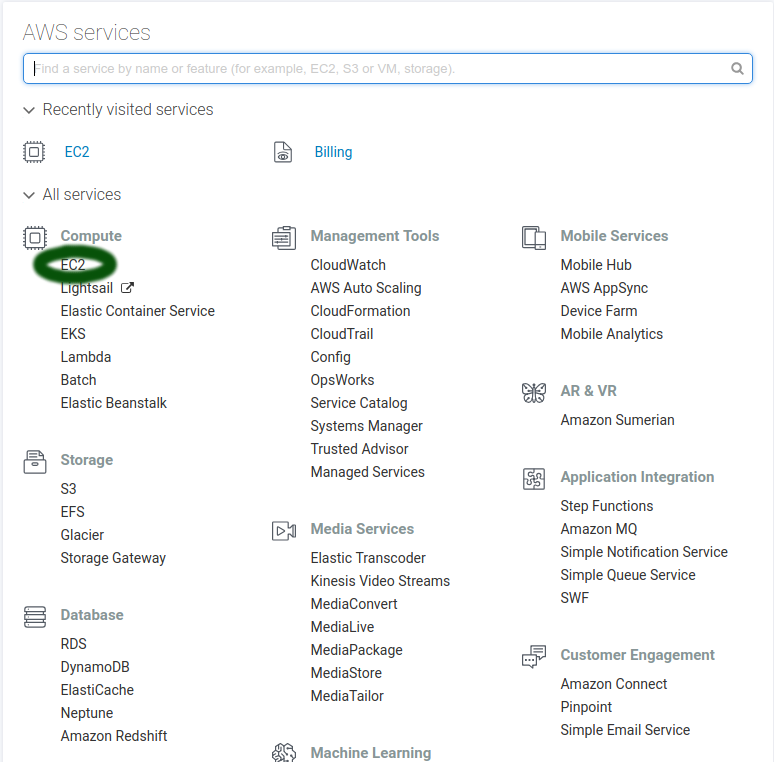

# aws-socks5-proxy

How-to guide for configuring an AWS instance as a SOCKS5 proxy server.  

# Introduction

Amazon Web Services (AWS) is Amazon's cloud computing service, which offers various levels of computing power, storage, and geo-location.  This guide will step through creating a Free tier EC2 instance, that will then be able to serve as a tunnel for your web traffic.   

There are many guides online that explain how to setup a tunnel over ssh for your web traffic.  This guide condenses some of that information, and is not meant to be all inclusive.  

# Account Creation

To create an account with AWS, visit the homepage: https://aws.amazon.com/  

1. Click the 'Sign Up' button in the upper right of the page.  

2. You will need to supply a valid e-mail address, choose a password, and an account name.  

3. Account verification will require a valid phone number.  

4. Full instructions are provided by Amazon at: https://docs.aws.amazon.com/AWSCloudFormation/latest/UserGuide/cfn-sign-up-for-aws.html  

# Establishing an EC2 instance

Again, after visiting the home page https://aws.amazon.com/ selecting 'My Account', then 'AWS Management Console' will bring you to the login page.  

You will be presented with the AWS services menu.  You will want to select 'EC2' from the 'Compute' category, as shown below.  



Now on the EC2 Dashboard page, you should follow the 'Launch Instance' button to begin setup.


There will be multiple types of Machine Images (AMIs) to choose from.  Each one represents a particular combination of operating system, installed tools, and storage.  Those which are free are marked as Free tier eligible.  For purposes of this guide, a Free Tier Amazon Linux is sufficient.  


You will need to choose a system configuration.  The Free tier eligible options is marked.  In this case, a t2.micro type is a 1vCPU @ 2.5 GHz, with 1GiB of RAM.  


Continue through the Options menus.  Options 3 'Configure Instance', 4 'Add Storage', and 5 'Add Tags' are not necessary to change.  

On step 6 'Configure Security Group', you will need to create firewall rules.  Choose a Security group name, if desired.  By default, the only open port will be 22 for SSH.  I recommend adding an additional high numbered port (> 1024) to configure for ssh after you login.  An obfuscated high level port is a deterrent against login attempts from bots.  

Amazon will warn you if you allow traffic from anywhere on the web.  If you will only be using your tunnel from one location, you should change the Source to My IP.  


Following review, you will finally click the 'Launch' button.  At this point, you will be prompted to create a key pair to ssh into your AWS instance.  This will save a '.pem' file.  Make sure this file is stored in a secure place.  

I recommend moving it to your ~/.ssh folder on linux, and running `chmod 700 yourfile.pem`.  


Once launched, back on the Homepage, you can now see your running instance on the Dashboard.


On the dashboard, you want to determine the DNS/IP address of your running instance.  Look for the Public DNS line, which will have the form `ec2-XX-XXX-XX-XXX.us-geo-X.compute.amazonaws.com.`  

# Configure SSH daemon

To access your instance for the first time, login with ssh:  

`$ ssh e2c-user@ec2-XX-XXX-XX-XXX.us-geo-X.compute.amazonaws.com -i ~/path/to/your/keypairfile.pem`  

On your first login, you will probably be prompted to run system updates.  You should do this at this time.  

Next, using your editor of choice (i.e. vim, nano, Emacs), modify the file /etc/ssh/sshd_config, i.e.  

`$ sudo vim /etc/ssh/sshd_config`  

You will want to un-comment and modify the following values:  
* Port XXXX (this can be left as 22 if you didn't choose a high number port earlier)
* AllowTcpForwarding yes
* TCPKeepAlive yes
* PermitTunnel yes

Save and quit when complete.  

Then, restart the sshd service by invoking:  

`$ sudo /etc/init.d/sshd restart`  

Logout.  

`$ exit`

# Configure Local Machine

Now that your EC2 instance is configured to allow tunneling, you can make some steps easier on your local computer.  

Again, using your favorite editor, modify the file `~/.ssh/config`.

You will make an entry for your EC2 instance.  Pick a hostname that makes sense, i.e. awstunnel.  


```
Host awstunnel
  User ec2-user
  Port XXXX
  HostName ec2-XX-XXX-XX-XXX.us-geo-X.compute.amazonaws.com
  IdentityFile ~/path/to/your/keypairfile.pem```


If everything worked correctly, you should be able to run:  

`$ ssh awstunnel`  

...and you will be connected to your EC2 instance.  

# Setting up the Tunnel

To be able to forward traffic over ssh, you will need to setup a port on your local machine to listen.  Run the command:  

`$ ssh awstunnel -D 6022 -qCN`  where:  

* 'awstunnel' matches the Host Name you set in your ssh config file
* -D XXXX can be any high numbered port not otherwise in use on the local machine
* -N tells the remote machine that no commands will be sent
* -C enables compression
* -q is a quiet mode that suppresses output


You can simplify this by creating a bash alias,  i.e . adding a line in your `~/.bashrc` file like:  

`alias sockstunnel='ssh awstunnel -D 6022 -qCN'` so that now, you will simply run:  

`$ sockstunnel` to accomplish the same steps as before.  

# Configuring a Web Browser to use the Tunnel

1. Chrome can be launched from the command line with:  `chromium --temp-profile  --proxy-server="socks5://localhost:6022"`.  Again, substitute 6022 with the port you configured to listen on your local machine.

2.  Firefox can be configured via Edit, Preferences, Network Proxy, Settings, and configuring the SOCKS host to localhost, with the port number you selected.


When you are done, you can visit a site like https://icanhazip.com/ to verify that your web traffic is now being routed through your AWS instance.


